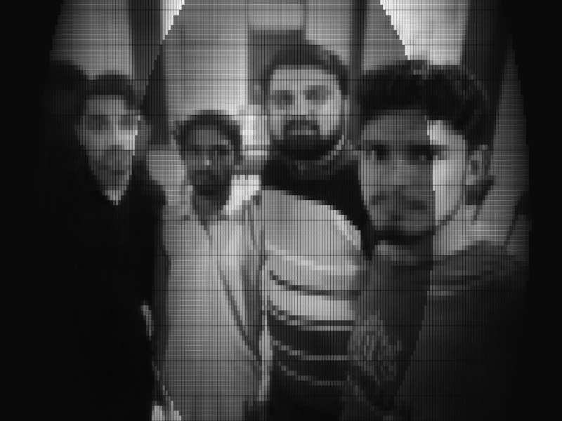
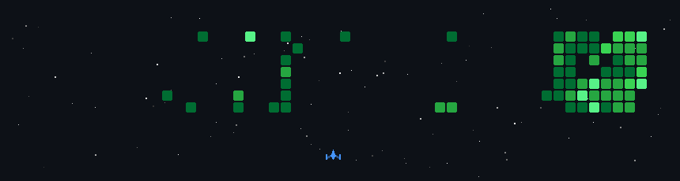

<!-- TOP WAVING HEADER BANNER -->

  

<!-- DYNAMIC TYPING SVG -->

  

<!-- PROFILE VIEWS BADGE WITH SHINE -->

  

  

<!-- SHINING LINE DIVIDER -->

  

<!-- ABOUT ME SECTION -->
<h3 align="left">
   
  <b>About Me</b>
</h3>

- 🔭 **Current Focus:** Working on [<ins>Spectre-S3-Payload</ins>](https://github.com/UsmanL/Spectre-S3-Payload)
- 🌱 **Learning:** Modern Web Architectures & Cloud Technologies
- 👯 **Open to Collaboration:** [<ins>ZeroTrace-Lab</ins>](https://github.com/UsmanL/ZeroTrace-Lab) (Full-Stack & IoT Projects)
- 💬 **Ask Me About:** Full-Stack Web Development, React, Node.js, Express & REST APIs
- ⚡ **Fun Fact:** My brain stays in an endless `while(true)` loop until a bug is resolved! 🐞

  

<!-- CONNECT WITH ME SECTION -->
<h3 align="left">
   
  <b>Connect With Me</b>
</h3>

  &nbsp;&nbsp;
  &nbsp;&nbsp;
  &nbsp;&nbsp;
  

  

<!-- TECH STACK & TOOLS SECTION -->
<h3 align="left">
   
  <b>Tech Stack & Tools</b>
</h3>

  

  

<!-- GITHUB STATS SECTION (RELIABLE BACKUP SERVERS) -->
<h3 align="left">
   
  <b>GitHub Analytics</b>
</h3>

  
  

  

  

<!-- SNAKE CONTRIBUTION ANIMATION -->
<h3 align="left">
  
  <b>Contribution Activity</b>
</h3>

  <picture>
    <source media="(prefers-color-scheme: dark)" srcset="https://raw.githubusercontent.com/UsmanL/UsmanL/output/github-contribution-grid-snake-dark.svg">
    <source media="(prefers-color-scheme: light)" srcset="https://raw.githubusercontent.com/UsmanL/UsmanL/output/github-contribution-grid-snake.svg">
    
  </picture>

<!-- SHINING LINE DIVIDER -->

  

<!-- ARCADE / CODING ACTIVITY SECTION -->
<h3 align="left">
 
  <b>Arcade / Coding Activity</b>
</h3>

  

  

<!-- OVERALL DEV STATS (METRICS MATRIX) -->
<h3 align="left">
  
  <b>Overall Dev Stats Matrix</b>
</h3>

<pre align="center">
┌────────────────────────────────────────────────────────────────────────┐
│  <b>SYSTEM STATUS</b>   : ONLINE                                              │
│  <b>PLAYER HANDSHAKE</b>: UsmanL @ GitHub                                     │
│  <b>ENERGY / STAMINA</b>: 🟩🟩🟩🟩🟩🟩🟩🟩🟩⬜ 90%                             │
│  <b>ACTIVE QUEST</b>    : Full-Stack Web Dev & Embedded Hardware             │
└────────────────────────────────────────────────────────────────────────┘
</pre>

  
   
  
  

<!-- FOOTER BANNER -->

  

